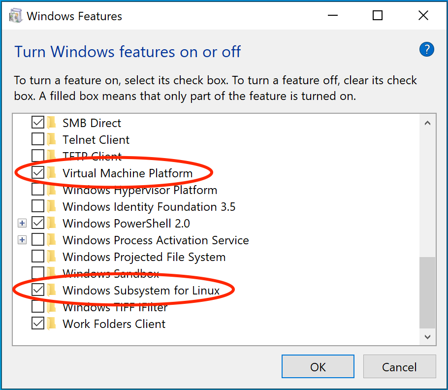

## Instalação next js

- `npx create-next-app@latest --empty`
- `y` - confirmar instalação dos pacotes
- nomear projeto
- linguagem `typescript`
- mova para a pasta do projeto para as próximas etapas
  - reabra o vscode na pasta ou utilize `'cd'` no terminal

## Padrão de nomenclatura de pastas

- Para criar pastas sem afetar a paginação: (nome_pasta)
- Para criar variáveis de URL: [urlId]

## Instalação tailwind

- `npm install tailwindcss @tailwindcss/postcss postcss`
- crie um arquivo o `postcss.config.mjs`
- cole o código abaixo nele:

  ```mjs
  const config = {
    plugins: {
      "@tailwindcss/postcss": {},
    },
  };
  export default config;
  ```

- crie o arquivo `./src/app/globals.css`
- importe o tailwind para ele:
  - `@import "tailwindcss";`

## Padrões de classes tailwind

- as numerações de tamanho são sempre multiplos de 4:

  `px-1 = padding: 4px` | `rounded-sm = border-radius: 4px`

- `w-full` : ocupa toda largura do container
- `hover:bg-blue` : para definir uma _pseudo-classe_
- `group` : atribui um padrão de estilização para os _elementos filhos_
  - add a class `'group'` no _elemento pai_ e `'group-hover:bg-blue'` no _elemento filho_
- seletores de responsividade:

  - `sm` : para telas acima de 640px
  - `md` : para telas acima de 768px

- estilização global:

  - defina a estilização global de sua aplicação no arquivo `layout.tsx`

- para não sobrescrever estilizações de tailwind:
  - instale o pacote TwMerge:
  - `npm i tailwind-merge`

## Props

- declarar parametros de componentes
- definir nome e tipo
- `?:` parametro opcional
- `children: ReactNode;` englobar um componente dentro de outro

  ```ts
  interface ButtonProps {
    text?: string;
  }
  ```

- ComponentProps `<'tag-html'>`

  - faz com que o componente possa receber
    quaisquer atributos do elemento html declarado

- Criar atributo para um elemento html baseado na prop:
  `data-prop={prop}`
  - dessa forma, pode-se criar _estilização
    condicional_ baseado no _prop_ recebido

## Padronização de formatação com Biome:

- https://biomejs.dev/guides/getting-started/

- instalação:

  - `npm install --save-dev --save-exact @biomejs/biome`
  - `npx @biomejs/biome init`

  criado o arquivo de configuração cole as preferencias abaixo:

  ```json
  {
    "$schema": "https://biomejs.dev/schemas/1.9.4/schema.json",
    "vcs": {
      "enabled": false,
      "clientKind": "git",
      "useIgnoreFile": false
    },
    "files": { "ignoreUnknown": false, "ignore": [] },
    "formatter": { "enabled": true, "indentStyle": "tab" },
    "organizeImports": { "enabled": true },
    "linter": {
      "enabled": true,
      "rules": { "recommended": true }
    },
    "javascript": { "formatter": { "quoteStyle": "double" } }
  }
  ```

  Para mais informações consulte o [guia biome](https://biomejs.dev/reference/vscode/)

- instale a extensão do vscode: `Biome`
- na barra de busca digite:

  - \>settings
  - selecione Open Workspace Settings (JSON)
  - Cole as preferencias abaixo:

  ```json
  {
  "explorer.fileNesting.expand": false,
  "[javascript]": {
  "editor.defaultFormatter": "biomejs.biome"
  },

  "[typescript]": {
  "editor.defaultFormatter": "biomejs.biome"
  },

  "[typescriptreact]": {
  "editor.defaultFormatter": "biomejs.biome"
  },
  "editor.codeActionsOnSave": {
  "source.organizeImports.biome": "explicit"
  }
  "editor.formatOnSave": true
  }
  ```

## Habilitar funções javascript:

- No topo do seu arquivo adicione: `'use client'`
- Assim as funções irão funcionar normalmente
- Para _preservar a performance_ da aplicação mantenha o `'use client'` apenas nos _componentes necessários_
  - isole o trecho em que há interação com usuário em um _novo componente_

## Tratando formulário

- instale a biblioteca: `npm i react-hook-form`
- importe a biblioteca:
  ```tsx
  const { register, handleSubmit } = useForm();
  ```
- Acionar funções com
  ```tsx
  < form onSubmit={handleSubmit(onSubscribe)}>
  ```
- Identifique os campos adicionando o _prop_:
  ```
  {...register('nome_campo')}
  ```
- biblioteca de validação:
  - `npm i zod @hookform/resolvers`
  - importe as bibliotecas:
    ```tsx
    import { useForm } from "react-hook-form";
    import { z } from "zod";
    ```
- crie uma configuração de validação:
  ```tsx
  const subscriptionSchema = z.object({
    name: z.string().min(2, "Digite seu nome completo"),
    email: z.string().email("Digite um e-mail válido"),
  });
  ```

## Instalando Docker:

1. Verifique se o seu sistema está com a virtualização ativada: https://docs.docker.com/desktop/troubleshoot/topics/#virtualization
   1. Caso você não tenha o WSL instalado ainda, não se preocupe, o instalador do próprio Docker também irá instalar ele.
   2. “Virtualization enabled in the BIOS” - Esse processo é diferente para cada marca de placa mãe, recomendamos a pesquisar pela sua fabricante.
      
2. Faça o download do instalador na página: https://docs.docker.com/desktop/install/windows-install/. Tome cuidado para baixar a versão correta: **x86_64** ou **ARM**
3. Duplo clique em `Docker Desktop Installer.exe` para executar o instalador.
4. Quando solicitado, certifique-se de que a opção "Use o WSL 2 em vez do Hyper-V" na página de Configuração está selecionada ou não, dependendo da sua escolha. (recomendamos usar WSL)
5. Se o seu sistema suportar apenas uma das duas opções, você não poderá selecionar qual usar.
6. Siga as instruções no assistente de instalação para autorizar o instalador e prosseguir com a instalação.
7. Quando a instalação for bem-sucedida, selecione `Fechar` para completar o processo de instalação.

Busque por Docker e selecione Docker Desktop nos resultados da busca.

### Adicionando ao projeto:

- Com o _Docker rodando_, utilize o terminal dentro da pasta `backend` do projeto para digitar os comandos abaixo:

  - `docker compose up -d` : executa os containers do postgres e redis (inicia o banco de dados)
  - `docker ps` : validar se os containers estão rodando corretamente

  > Recomendado adicionar o arquivo .env ao .gitignore, pois pode conter dados sensíveis como servidores ou senhas de banco de dados.

- `docker logs <id_container>` : Validar eventuais erros nos containers
- `npm run db:migrate` : Rodar banco de dados (na pasta backend)

## Conectando backend ao frontend:

- instale o orval para criar a configuração de conexão e rotas da api:
  - `npm i orval -D`
- crie um arquivo de configuração na raiz do projeto `orval.config.ts` e adicione o código abaixo:

  ```ts
  import { defineConfig } from "orval";

  export default defineConfig({
    api: {
      input: "http://localhost:3333/docs/json",
      output: {
        target: "./src/http/api.ts",
        client: "fetch",
        httpClient: "fetch",
        clean: true,
        baseUrl: "http://localhost:3333",

        override: {
          fetch: {
            includeHttpResponseReturnType: false,
          },
        },
      },
    },
  });
  ```

- execute o orval: `npx orval`
- Assim o orval irá gerar um arquivo com as seguintes informações da sua api:
  - parâmetros
  - rotas
  - requisições
  - respostas
  - funções
